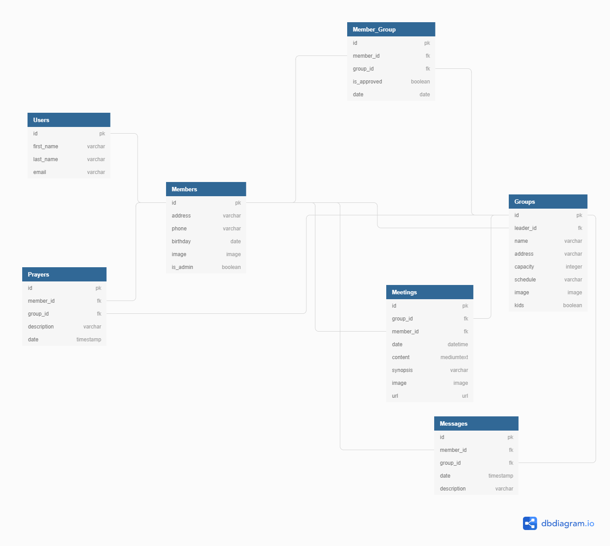

Small Connections is a back-end capstone project by [Brian Cravens](https://github.com/BrianCravens) for [Nashville Software School C40](https://github.com/nss-day-cohort-40)

## Brief Proposal

Churches that utilize small groups will be able to use this as a communications platform for their members to better communicate between one another.  New members can search for groups to join, and once in a group submit prayer requests as well as send messages to other members of the group.  Leaders can establish meetings to keep everyone up to date on when and where the meetings will be held.

## Project Definition

* Front End is written in React.
* Users can create and account, login, and logout.
* Ability to create new groups once you become an admin user.
* Leaders can accept incoming request to join their group.
* Leaders are able to monitor all communication and members.
* Leaders can add New Meetings as well as edit meetings.
* Leaders can pass leadership over to another current member.
* Users can create their profile and keep it updated as well as join/leave groups.
* Users can view the members of their group.
* Users can view all group messages, prayer requests, and meetings.

## Setup

Steps to get started:
1. `git clone git@github.com:BrianCravens/SmallConnections.git`
1. `cd` into the directory it creates
1. `npm install` to build dependencies
1. `npm start` to run the app in the development mode
1. Open [http://localhost:3000](http://localhost:3000) to view it in the browser.

## Technologies Used

This project utilizes the following:
* This project was created with [Create React App](https://github.com/facebook/create-react-app).
* [React Router](https://reacttraining.com/react-router/) for page routing
* [React-bootstrap](https://react-bootstrap.github.io/) for menu, flexible formatting

## Skills Utilized

We utilized all skills and concepts learned up to this point in our time here at NSS, including:

1. React: hooks, state, props, routes
1. API calls with: POST, PUT, DELETE, and GET
1. Javascript: functions, objects, arrays, mapping
1. Persistent data storage with a REST API
1. Github Scrum workflow
1. CSS and Bootstrap styling

## Database Diagram

## Wireframe
[Small Connections Wireframe](https://sketchboard.me/VCkbTFf8Frct)